# Phased admin API readiness

**Execution playbook** for wiring the admin app to routes that **exist today** in [`collection.json`](../collection.json). Work in **small phases** to avoid overload; ship and verify each phase before the next.

| Reference | Link |
|-------------|------|
| Postman / OpenAPI source | [`collection.json`](../collection.json) |
| RTK layer | [`src/services/adminApi.ts`](../src/services/adminApi.ts) (`LIVE_GET`, `tryLiveRead`, mutations) |
| What stays mock / unknown | [`current-gaps.md`](current-gaps.md), [`myticket_admin_api_collection_gaps.md`](myticket_admin_api_collection_gaps.md) |
| Deeper technical notes | [`myticket_admin_endpoints_implementation_plan.md`](myticket_admin_endpoints_implementation_plan.md) |

---

## Operating principles

1. **Reads default to mock**  
   Keep `VITE_ADMIN_READS_SOURCE=mock` in `.env` until the slices you care about are implemented and tested. Switch to `api` when `LIVE_GET` entries for those reads are non-null and mappers are in place (globally, or introduce per-slice env flags later if needed).

2. **Errors vs mock fallback**  
   - **Wired endpoint** (non-null `LIVE_GET`, authenticated): on **4xx/5xx** or **mapper parse failure**, return an RTK **error** so the UI can show failure (do not silently fall back to mock for that endpoint).  
   - **No collection route** (e.g. platform counters, leaderboards): **always mock**; optional `console.warn` when `VITE_ADMIN_READS_SOURCE=api` (already handled via `warnReadFallback` pattern).

3. **Explicit “remains mock” until backend/collection**  
   - `getPlatformCounters`, `getLeaderboards` — no matching `GET` in the collection.  
   - `getTalentProfile` — no `GET …/profiles/talents/{id}`; use list + client lookup, or keep mock detail until a detail route exists.  
   - Any host **404** for a route that exists in Postman — track under deploy/version mismatch in [`current-gaps.md`](current-gaps.md).

4. **Path prefix**  
   All admin URLs below are under **`/api/v1/admin`** (prepend `VITE_API_BASE_URL`).

---

## Mock vs live (after all phases implemented)

| RTK read | Collection `GET` | After phases | Stays mock |
|----------|------------------|--------------|------------|
| `getDashboardSummary` | `dashboard/summary` | Phase 1 | — |
| `getPendingActions` | `dashboard/pending-actions` | Phase 1 | — |
| `getPlatformCounters` | *(none)* | — | Always |
| `getLeaderboards` | *(none)* | — | Always |
| `getRoleApplications` | `role-applications` | Phase 2 | — |
| `getRoleApplication` | `role-applications/{id}` | Phase 2 | — |
| `getTalentProfiles` | `profiles/talents` | Phase 3 | — |
| `getTalentProfile` | list only | Phase 3 (lookup in list / cache) | If id missing from list |
| `getUsers` | `users` | Phase 4 | — |
| `getUser` | `users/{id}` | Phase 4 | — |
| `getEvents` | `events` | Phase 5 | — |
| `getEvent` | `events/{id}` | Phase 5 | — |
| `getCategories` | `event-categories` | Phase 6 | — |
| `getFeaturedConfig` | `featured-events/config` | Phase 6 | — |
| `getFeeConfiguration` | `finance/fee-configurations` | Phase 6 | — |
| `getNotificationSettings` | `notification-settings` | Phase 6 | — |
| `getFinancialAnalytics` | `analytics/financial` | Phase 8 | Counters/leaderboards still mock |
| `getListingModeration` | `moderation-queue` | Phase 7 | — |
| `getRatingsModeration` | `ratings` | Phase 7 | — |
| `getSupportThreads` | `support-cases` | Phase 7 | — |
| `getSupportThread` | `support-cases/{id}` | Phase 7 | — |

---

## Phase 0 — Shared plumbing

**Scope:** One place for JSON envelopes and list normalization; extend read pipeline so each phase only adds mappers + `LIVE_GET` values.

**Deliverables**

- [ ] New [`src/lib/apiJson.ts`](../src/lib/apiJson.ts): `unwrapApiJson`, `asArray`, `asObject`, `pickStr`, `pickNum`, `pickBool` (Laravel `data` wrapper; snake_case tolerance).
- [ ] New mapper module(s), e.g. [`src/schemas/api/adminMappers.ts`](../src/schemas/api/adminMappers.ts) (or split `mapDashboard.ts`, `mapUsers.ts`, … if files grow large).
- [ ] Refactor [`adminApi.ts`](../src/services/adminApi.ts): extend `tryLiveRead` (or add `tryLiveReadMapped`) to accept:
  - optional **query `params`** (for `analytics/financial`),
  - optional **`map(raw: unknown) => T`** after successful GET.

**Acceptance**

- [ ] `npm run build` and `npm test` pass.
- [ ] No behavior change for `VITE_ADMIN_READS_SOURCE=mock` until `LIVE_GET` is filled in later phases.

**Still mock**

- All reads until `LIVE_GET` populated per phase.

---

## Phase 1 — Dashboard reads

**Scope:** Home dashboard tiles backed by collection `GET`s.

**Collection**

- `GET /api/v1/admin/dashboard/summary`
- `GET /api/v1/admin/dashboard/pending-actions`

**Code**

- [ ] Set `LIVE_GET.getDashboardSummary`, `LIVE_GET.getPendingActions` in [`adminApi.ts`](../src/services/adminApi.ts).
- [ ] Implement mappers → existing Zod types: [`dashboard.schema.ts`](../src/schemas/dashboard.schema.ts) (`dashboardSummarySchema`, `pendingActionsResponseSchema`).

**Acceptance**

- [ ] With token + `VITE_ADMIN_READS_SOURCE=api`, dashboard loads without mock fallback for those two queries (or shows RTK error if API fails).
- [ ] `getPlatformCounters` / `getLeaderboards` unchanged (mock).

---

## Phase 2 — Role applications

**Scope:** Approvals list + detail for non-talent flow.

**Collection**

- `GET /api/v1/admin/role-applications`
- `GET /api/v1/admin/role-applications/{id}`

**Code**

- [ ] `LIVE_GET.getRoleApplications`, `LIVE_GET.getRoleApplication` (template with `:id` replaced in `queryFn`).
- [ ] Mappers → [`roleApplication.schema.ts`](../src/schemas/roleApplication.schema.ts) (`roleApplicationSchema`, `roleApplicationsListSchema`).

**Acceptance**

- [ ] `/approvals/roles` and `/approvals/roles/:id` work with live data when enabled.

**Still mock**

- Platform / leaderboards (unchanged).

---

## Phase 3 — Talent queue (profiles)

**Scope:** Talent list from profiles API; detail without dedicated `GET …/{id}`.

**Collection**

- `GET /api/v1/admin/profiles/talents`

**Code**

- [ ] `LIVE_GET.getTalentProfiles` = `/api/v1/admin/profiles/talents`.
- [ ] Mapper: API row → `TalentProfile` ([`talentApproval.schema.ts`](../src/schemas/talentApproval.schema.ts)); use safe defaults for UI-only fields if API is slimmer.
- [ ] `getTalentProfile(id)`: when `api` mode, resolve from **cached list** (`getTalentProfiles` providesTags) or refetch list and `find`; if not found → **404** (document; do not silently mock).

**Acceptance**

- [ ] `/approvals/talent` lists live data when enabled.
- [ ] Detail page works when id exists in list.

**Still mock / note**

- Approve/reject remain `POST …/role-applications/{id}/…` — confirm **id** matches talent row id ([`current-gaps.md`](current-gaps.md) §B).

---

## Phase 4 — Users

**Collection**

- `GET /api/v1/admin/users`
- `GET /api/v1/admin/users/{id}`

**Code**

- [ ] `LIVE_GET.getUsers`, `LIVE_GET.getUser`.
- [ ] Mappers → `AdminUserRow` / `AdminUserDetail` ([`user.schema.ts`](../src/schemas/user.schema.ts)).

**Acceptance**

- [ ] `/users` and `/users/:id` with live reads when enabled.

---

## Phase 5 — Events

**Collection**

- `GET /api/v1/admin/events`
- `GET /api/v1/admin/events/{id}`

**Code**

- [ ] `LIVE_GET.getEvents`, `LIVE_GET.getEvent`.
- [ ] Mappers → `AdminEventRow` ([`event.schema.ts`](../src/schemas/event.schema.ts)).

**Acceptance**

- [ ] Events list and event detail pages use live data when enabled.

**Note**

- Cancellation flow already uses `POST …/events/{id}/reject` when token present ([`adminApi.ts`](../src/services/adminApi.ts)); product meaning unchanged.

---

## Phase 6 — Catalog + settings

**Scope:** Categories CRUD (except DELETE in UI), featured config, fees, notification settings reads; align category **writes** with Postman.

**Collection (reads)**

- `GET /api/v1/admin/event-categories`
- `GET /api/v1/admin/featured-events/config`
- `GET /api/v1/admin/finance/fee-configurations`
- `GET /api/v1/admin/notification-settings`

**Collection (writes — category)**

- `POST /api/v1/admin/event-categories` (body: `slug`, `name_en`, `name_ar`, `icon_key`, `color_token`, `is_active`, `display_order`)
- `PATCH /api/v1/admin/event-categories/{id}`
- `DELETE /api/v1/admin/event-categories/{id}` — wired as `deleteEventCategory` + delete control on [`EventCategoriesPage.tsx`](../src/pages/events/EventCategoriesPage.tsx).

**Code**

- [ ] Set the four `LIVE_GET` keys above.
- [ ] Category mapper: API ↔ `EventCategory` (`name` ↔ `name_en`, `iconKey` ↔ `icon_key`, `active` ↔ `is_active`, string `id`).
- [ ] Mutations `upsertCategory`, `toggleCategoryActive`: when `sessionHasApiCredentials()`, call `POST`/`PATCH` with mapped body; keep mock-only path without token.
- [ ] Featured / fee / notification GET mappers (reuse existing Zod schemas where possible).

**Acceptance**

- [ ] `/events/categories`, `/events/featured`, `/settings/fees`, `/settings/notifications` use live reads when enabled.
- [ ] Category create/edit/toggle hit API when signed in.

---

## Phase 7 — Support, moderation, ratings

**Collection**

- `GET /api/v1/admin/support-cases`
- `GET /api/v1/admin/support-cases/{id}`
- `GET /api/v1/admin/moderation-queue`
- `GET /api/v1/admin/ratings`

**Code**

- [ ] Set four `LIVE_GET` entries; mappers for [`support.schema.ts`](../src/schemas/support.schema.ts), [`moderation.schema.ts`](../src/schemas/moderation.schema.ts) (`listingModerationRowSchema`, `ratingRowSchema` / `ratingListSchema`).
- [x] Moderation **mutations**: `claim` / `release` / `reject` / `escalate` + existing `approve` on [`ListingsPage.tsx`](../src/pages/moderation/ListingsPage.tsx); ratings **hide** / **restore** / **delete** on [`RatingsPage.tsx`](../src/pages/moderation/RatingsPage.tsx) (`ratingsModerationState` for mock writes).

**Acceptance**

- [ ] `/support`, `/support/:id`, `/moderation/listings`, `/moderation/ratings` live lists when enabled.

---

## Phase 8 — Analytics (financial only)

**Collection**

- `GET /api/v1/admin/analytics/financial` (query string **not** documented in Postman — trial `range`, `period`, or `window` and adjust when backend confirms).

**Code**

- [ ] `LIVE_GET.getFinancialAnalytics` + `params` from UI `RevenueChartRange` (`7d` / `30d` / `90d`).
- [ ] Mapper → `financialAnalyticsSchema` ([`analytics.schema.ts`](../src/schemas/analytics.schema.ts)); on mismatch, RTK error (do not merge unknown API into mock silently).

**Acceptance**

- [ ] `/analytics` chart + totals from API when query matches backend.

**Still mock**

- `getPlatformCounters`, `getLeaderboards`.

---

## Phase 9 — Auth pages (forgot / reset)

**Scope:** Wire marketing-free flows to admin auth routes in the collection.

**Collection**

- `POST /api/v1/admin/auth/password/forgot`
- `POST /api/v1/admin/auth/password/reset`

**Code**

- [x] [`ForgotPasswordPage.tsx`](../src/pages/auth/ForgotPasswordPage.tsx): `fetch`/`POST` with `{ email }` via [`adminPasswordReset.ts`](../src/lib/adminPasswordReset.ts).
- [x] [`ResetPasswordPage.tsx`](../src/pages/auth/ResetPasswordPage.tsx): `POST` with `{ token, password }`; token from `?token=` only (no demo default).

**Acceptance**

- [ ] End-to-end against staging when mail/token flow exists.

**Out of scope**

- OAuth admin callback unless explicitly requested later.

---

## Global acceptance (after Phase 9)

- [x] `npm run build`, `npm test`, `npm run lint` (last run: all green).
- [ ] Smoke with `VITE_ADMIN_READS_SOURCE=api` + real login on a host where routes are deployed.
- [ ] Update [`current-gaps.md`](current-gaps.md) when backend confirms ambiguous query names (e.g. financial `range`) or new example payloads land.

**Roadmap note:** Phases **0–9** cover collection-aligned reads + forgot/reset auth. Extra collection POSTs (users unsuspend/impersonate, events approve/feature/unfeature, moderation/ratings actions above) are implemented and tracked in [`current-gaps.md`](current-gaps.md) §B / §E.

---

## Order of execution

```mermaid
flowchart LR
  P0[Phase0_Plumbing]
  P1[Phase1_Dashboard]
  P2[Phase2_Roles]
  P3[Phase3_Talent]
  P4[Phase4_Users]
  P5[Phase5_Events]
  P6[Phase6_CatalogSettings]
  P7[Phase7_SupportModRatings]
  P8[Phase8_AnalyticsFinancial]
  P9[Phase9_AuthPages]
  P0 --> P1 --> P2 --> P3
  P3 --> P4 --> P5 --> P6
  P6 --> P7 --> P8 --> P9
```

Phases **4–5** can be swapped with **2–3** if priorities change; **0** must be first; **9** can run in parallel with **8** if staffed separately.
