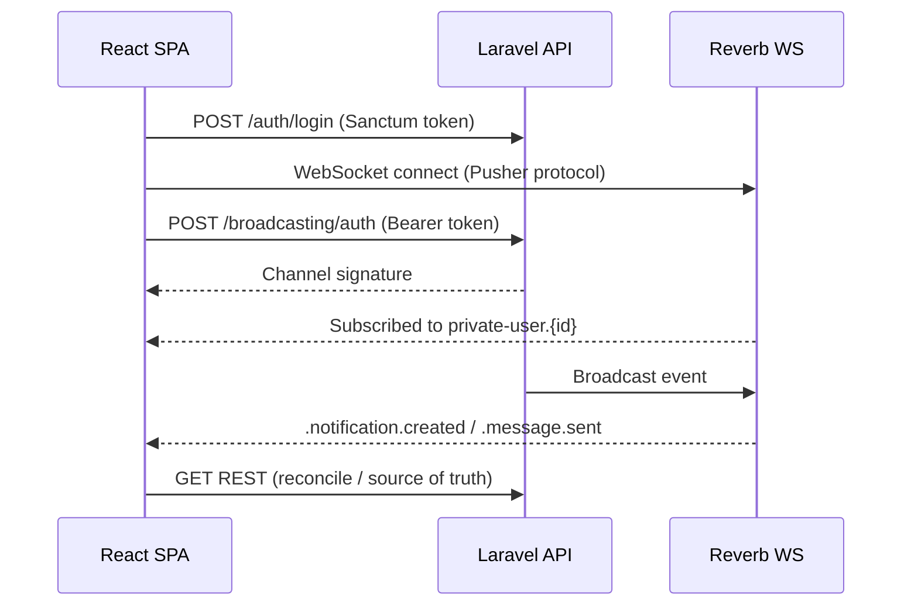

# MyTicket — unified React realtime integration guide

**Date:** 2026-06-13  
**Audience:** All React frontends (main, admin, organizer, scanner, talent, vendor)  
**Stack:** Laravel Reverb + Sanctum Bearer auth + Laravel Echo + `pusher-js`  
**Backend reference:** [`frontend-handoff-reverb-realtime-and-unified-chat.md`](frontend-handoff-reverb-realtime-and-unified-chat.md)  
**Chat REST API (requests/responses per app):** [`frontend-handoff-chat-api.md`](frontend-handoff-chat-api.md)

This is the **single guide** every React app should follow: install → configure → wire → test.

### Production hosts (kat-jr.com)

| Role | URL |
|------|-----|
| **API** | `https://myticket-api.kat-jr.com` |
| **Main website** | `https://myticket.kat-jr.com` |
| **Admin** | `https://myticket-admin.kat-jr.com` |
| **Organizer** | `https://myticket-organizer.kat-jr.com` |
| **Scanner** | `https://myticket-scanner.kat-jr.com` |
| **Talent** | `https://myticket-talent.kat-jr.com` |
| **Vendor** | `https://myticket-vendor.kat-jr.com` |

| Reverb (browser) | Value |
|------------------|--------|
| Host | `myticket-api.kat-jr.com` |
| Port | `443` |
| Scheme | `https` |
| App key (`VITE_REVERB_APP_KEY`) | `fysuwmddunkddyla1das` |
| WebSocket URL | `wss://myticket-api.kat-jr.com/app/fysuwmddunkddyla1das` |

`REVERB_APP_SECRET` and `REVERB_APP_ID` (`163194`) are **API server only** — never put them in React `.env` files.

---

## 1. How it works



**Rules**

1. WebSocket = **push hint** — always reconcile with REST.
2. One Echo instance per logged-in session; disconnect on logout.
3. Use **Bearer token** on `/broadcasting/auth` (works for all SPAs on different domains).
4. `VITE_REVERB_APP_KEY` must match backend `REVERB_APP_KEY`.

---

## 2. App matrix (copy the row for your repo)

| React app | Production site | API base | Login (production) | Token ability | Conversations | Channels |
|-----------|-----------------|----------|-------------------|---------------|---------------|----------|
| **Main** | `https://myticket.kat-jr.com` | `https://myticket-api.kat-jr.com/api/v1/main` | `POST .../main/auth/login` | `app:main` | `.../main/me/conversations` | `user.{id}` |
| **Talent** | `https://myticket-talent.kat-jr.com` | same as main | same as main | `app:main` | `.../main/me/conversations` | `user.{id}` |
| **Vendor** | `https://myticket-vendor.kat-jr.com` | same as main | same as main | `app:main` | `.../main/me/conversations` | `user.{id}` |
| **Organizer** | `https://myticket-organizer.kat-jr.com` | `https://myticket-api.kat-jr.com/api/v1/organizer` | `POST .../organizer/auth/login` | `app:organizer` | `.../organizer/me/conversations` | `user.{id}` |
| **Admin** | `https://myticket-admin.kat-jr.com` | `https://myticket-api.kat-jr.com/api/v1/admin` | `POST .../admin/auth/login` | `app:admin` | — | `user.{id}` + `admin.verifications` + `admin.tourism_ads` |
| **Scanner** | `https://myticket-scanner.kat-jr.com` | `https://myticket-api.kat-jr.com/api/v1/scanner` | `POST .../scanner/auth/login` | `app:scanner` | — | `user.{id}` |

**Broadcasting auth (all apps):** `POST https://myticket-api.kat-jr.com/broadcasting/auth`

**Local dev URLs** (optional): see [§4.3](#43-local-development-optional).

---

## 3. Step 1 — Install packages (every React repo)

```bash
npm install laravel-echo pusher-js
```

**Vite** (recommended): env vars use `VITE_` prefix (below).  
**Create React App**: use `REACT_APP_` instead of `VITE_` and `process.env.REACT_APP_*`.

---

## 4. Step 2 — Environment variables

### 4.1 Production — API server (`myticket-api.kat-jr.com`)

These live in the API `.env` on the VPS (already configured):

```env
APP_URL=https://myticket-api.kat-jr.com

BROADCAST_CONNECTION=reverb

REVERB_SERVER_HOST=0.0.0.0
REVERB_SERVER_PORT=8080

REVERB_APP_ID=163194
REVERB_APP_KEY=fysuwmddunkddyla1das
REVERB_APP_SECRET=tdk0njvtvyehfic6pytr
REVERB_HOST=myticket-api.kat-jr.com
REVERB_PORT=443
REVERB_SCHEME=https

FRONTEND_MAIN_URL=https://myticket.kat-jr.com
FRONTEND_ADMIN_URL=https://myticket-admin.kat-jr.com
FRONTEND_ORGANIZER_URL=https://myticket-organizer.kat-jr.com
FRONTEND_SCANNER_URL=https://myticket-scanner.kat-jr.com
FRONTEND_TALENT_URL=https://myticket-talent.kat-jr.com
FRONTEND_VENDOR_URL=https://myticket-vendor.kat-jr.com
```

After changing API `.env`:

```bash
php artisan config:clear && php artisan config:cache
sudo supervisorctl restart myticket-api-reverb
```

### 4.2 Production — every React app (`.env.production`)

Use the **same Reverb key** in all frontends. Only `VITE_API_URL` path prefix differs per app if you bake routes in code; the origin is always the API host.

```env
VITE_API_URL=https://myticket-api.kat-jr.com
VITE_REVERB_APP_KEY=fysuwmddunkddyla1das
VITE_REVERB_HOST=myticket-api.kat-jr.com
VITE_REVERB_PORT=443
VITE_REVERB_SCHEME=https
```

| Deployed SPA | Set at build time (CI/hosting) |
|--------------|-------------------------------|
| `myticket.kat-jr.com` | `.env.production` above |
| `myticket-admin.kat-jr.com` | same |
| `myticket-organizer.kat-jr.com` | same |
| `myticket-scanner.kat-jr.com` | same |
| `myticket-talent.kat-jr.com` | same |
| `myticket-vendor.kat-jr.com` | same |

Rebuild after any change: `npm run build`.

**CORS:** API [`config/cors.php`](../../config/cors.php) allows each `FRONTEND_*_URL` automatically. Ensure talent/vendor URLs are in API `.env` if those apps call the API from the browser.

### 4.3 Local development (optional)

**React `.env.local`:**

```env
VITE_API_URL=http://localhost:8000
VITE_REVERB_APP_KEY=fysuwmddunkddyla1das
VITE_REVERB_HOST=127.0.0.1
VITE_REVERB_PORT=8080
VITE_REVERB_SCHEME=http
```

**API `.env` (local):**

```env
APP_URL=http://localhost:8000
BROADCAST_CONNECTION=reverb
REVERB_APP_ID=163194
REVERB_APP_KEY=fysuwmddunkddyla1das
REVERB_APP_SECRET=tdk0njvtvyehfic6pytr
REVERB_HOST=127.0.0.1
REVERB_PORT=8080
REVERB_SCHEME=http
REVERB_SERVER_HOST=0.0.0.0
REVERB_SERVER_PORT=8080
```

```bash
composer dev
```

---

## 5. Step 3 — Shared modules (copy into each repo)

Recommended layout:

```
src/
  lib/
    realtime/
      config.ts       # read env, build API paths
      echo.ts         # create / destroy Echo
      channels.ts     # subscribe / unsubscribe helpers
      types.ts        # envelope types
  hooks/
    useRealtime.ts    # connect on login, disconnect on logout
```

### 5.1 `src/lib/realtime/config.ts`

```typescript
export const apiUrl = import.meta.env.VITE_API_URL?.replace(/\/$/, '') ?? '';

export const reverbConfig = {
  key: import.meta.env.VITE_REVERB_APP_KEY as string,
  host: import.meta.env.VITE_REVERB_HOST as string,
  port: Number(import.meta.env.VITE_REVERB_PORT ?? 8080),
  scheme: (import.meta.env.VITE_REVERB_SCHEME ?? 'http') as 'http' | 'https',
};

export function apiPath(appPrefix: string, path: string): string {
  return `${apiUrl}${appPrefix}${path}`;
}

/** e.g. appPrefix = '/api/v1/main' | '/api/v1/organizer' | '/api/v1/admin' */
export type ApiAppPrefix = '/api/v1/main' | '/api/v1/organizer' | '/api/v1/admin' | '/api/v1/scanner';
```

### 5.2 `src/lib/realtime/types.ts`

```typescript
export type RealtimeEnvelope<T = Record<string, unknown>> = {
  type: string;
  payload: T;
  occurred_at: string;
};

export type NotificationPayload = {
  id: number;
  user_id: number;
  kind: string;
  title: string;
  body: string | null;
  href: string | null;
  is_read: boolean;
  created_at: string | null;
};

export type MessagePayload = {
  id: number;
  conversation_id: number;
  sender_user_id: number;
  sender_role: string;
  body: string;
  attachment_url: string | null;
  created_at: string | null;
};
```

### 5.3 `src/lib/realtime/echo.ts`

```typescript
import Echo from 'laravel-echo';
import Pusher from 'pusher-js';
import { apiUrl, reverbConfig } from './config';

declare global {
  interface Window {
    Pusher: typeof Pusher;
    Echo?: Echo<'reverb'>;
  }
}

window.Pusher = Pusher;

let echoInstance: Echo<'reverb'> | null = null;

export function getEcho(): Echo<'reverb'> | null {
  return echoInstance;
}

export function connectEcho(token: string): Echo<'reverb'> {
  disconnectEcho();

  echoInstance = new Echo({
    broadcaster: 'reverb',
    key: reverbConfig.key,
    wsHost: reverbConfig.host,
    wsPort: reverbConfig.port,
    wssPort: reverbConfig.port,
    forceTLS: reverbConfig.scheme === 'https',
    enabledTransports: ['ws', 'wss'],
    authEndpoint: `${apiUrl}/broadcasting/auth`,
    auth: {
      headers: {
        Authorization: `Bearer ${token}`,
        Accept: 'application/json',
      },
    },
  });

  window.Echo = echoInstance;
  return echoInstance;
}

export function disconnectEcho(): void {
  echoInstance?.disconnect();
  echoInstance = null;
  window.Echo = undefined;
}
```

### 5.4 `src/lib/realtime/channels.ts`

```typescript
import type { RealtimeEnvelope, MessagePayload, NotificationPayload } from './types';
import { getEcho } from './echo';

export type RealtimeHandlers = {
  onNotification?: (payload: NotificationPayload) => void;
  onGovernmentId?: (payload: Record<string, unknown>) => void;
  onEngagementStatus?: (payload: Record<string, unknown>) => void;
  onMessageInbox?: (payload: MessagePayload) => void;
  onAdminVerification?: (payload: Record<string, unknown>) => void;
};

export function subscribeUserChannel(userId: number, handlers: RealtimeHandlers): void {
  const echo = getEcho();
  if (!echo) return;

  const channel = echo.private(`user.${userId}`);

  if (handlers.onNotification) {
    channel.listen('.notification.created', (envelope: RealtimeEnvelope<NotificationPayload>) => {
      handlers.onNotification?.(envelope.payload);
    });
  }
  if (handlers.onGovernmentId) {
    channel.listen('.government_id.status_changed', (envelope: RealtimeEnvelope) => {
      handlers.onGovernmentId?.(envelope.payload);
    });
  }
  if (handlers.onEngagementStatus) {
    channel.listen('.engagement.status_changed', (envelope: RealtimeEnvelope) => {
      handlers.onEngagementStatus?.(envelope.payload);
    });
  }
  if (handlers.onMessageInbox) {
    channel.listen('.message.sent', (envelope: RealtimeEnvelope<MessagePayload>) => {
      handlers.onMessageInbox?.(envelope.payload);
    });
  }
}

export function subscribeAdminVerifications(onUpdate: (payload: Record<string, unknown>) => void): void {
  const echo = getEcho();
  if (!echo) return;

  echo.private('admin.verifications').listen(
    '.government_id.status_changed',
    (envelope: RealtimeEnvelope) => onUpdate(envelope.payload),
  );
}

export function subscribeAdminTourismAds(onUpdate: (payload: Record<string, unknown>) => void): void {
  const echo = getEcho();
  if (!echo) return;

  echo.private('admin.tourism_ads').listen(
    '.tourism_ad.status_changed',
    (envelope: RealtimeEnvelope) => onUpdate(envelope.payload),
  );
}

let activeConversationId: number | null = null;

export function subscribeConversation(
  conversationId: number,
  onMessage: (payload: MessagePayload) => void,
): void {
  leaveConversation();
  activeConversationId = conversationId;
  getEcho()
    ?.private(`conversation.${conversationId}`)
    .listen('.message.sent', (envelope: RealtimeEnvelope<MessagePayload>) => {
      onMessage(envelope.payload);
    });
}

export function leaveConversation(): void {
  if (activeConversationId !== null) {
    getEcho()?.leave(`conversation.${activeConversationId}`);
    activeConversationId = null;
  }
}
```

### 5.5 `src/hooks/useRealtime.ts`

```typescript
import { useEffect, useRef } from 'react';
import { connectEcho, disconnectEcho } from '../lib/realtime/echo';
import {
  subscribeAdminVerifications,
  subscribeUserChannel,
  type RealtimeHandlers,
} from '../lib/realtime/channels';

type Options = {
  token: string | null;
  userId: number | null;
  isAdmin?: boolean;
  handlers: RealtimeHandlers;
};

export function useRealtime({ token, userId, isAdmin = false, handlers }: Options): void {
  const handlersRef = useRef(handlers);
  handlersRef.current = handlers;

  useEffect(() => {
    if (!token || !userId) {
      disconnectEcho();
      return;
    }

    connectEcho(token);
    subscribeUserChannel(userId, {
      onNotification: (p) => handlersRef.current.onNotification?.(p),
      onGovernmentId: (p) => handlersRef.current.onGovernmentId?.(p),
      onEngagementStatus: (p) => handlersRef.current.onEngagementStatus?.(p),
      onMessageInbox: (p) => handlersRef.current.onMessageInbox?.(p),
    });

    if (isAdmin) {
      subscribeAdminVerifications((p) => handlersRef.current.onAdminVerification?.(p));
    }

    return () => disconnectEcho();
  }, [token, userId, isAdmin]);
}
```

### 5.6 Wire in your app root (example)

```tsx
// After login you have token + user from GET /me
useRealtime({
  token: auth.token,
  userId: auth.user?.id ?? null,
  isAdmin: auth.user?.role === 'admin',
  handlers: {
    onNotification: (payload) => {
      queryClient.invalidateQueries({ queryKey: ['notifications'] });
      toast(payload.title);
    },
    onMessageInbox: (payload) => {
      queryClient.invalidateQueries({ queryKey: ['conversations', 'unread-count'] });
      if (activeConversationId !== payload.conversation_id) {
        toast('New message');
      }
    },
    onGovernmentId: () => {
      queryClient.invalidateQueries({ queryKey: ['government-id'] });
    },
    onAdminVerification: () => {
      queryClient.invalidateQueries({ queryKey: ['admin', 'verifications'] });
    },
  },
});
```

On **logout**: call `disconnectEcho()` and clear token.

---

## 6. Step 4 — REST APIs to pair with realtime

### 6.1 Notifications

| Action | Main / talent / vendor | Organizer |
|--------|------------------------|-----------|
| List | `GET https://myticket-api.kat-jr.com/api/v1/main/me/notifications` | `GET https://myticket-api.kat-jr.com/api/v1/organizer/me/notifications` |
| Incremental | `?since=2026-06-13T10:00:00Z` | same |
| Stream hint | `GET .../main/me/notifications/stream` | `GET .../organizer/me/notifications/stream` |
| Mark read | `PATCH .../me/notifications/{id}/read` | same |

**Reconcile on `.notification.created`:**

```typescript
await fetch(
  `https://myticket-api.kat-jr.com/api/v1/main/me/notifications?since=${lastFetchIso}`,
  { headers: { Authorization: `Bearer ${token}`, Accept: 'application/json' } },
);
```

### 6.2 Conversations (main + organizer)

| Action | Main / talent / vendor | Organizer |
|--------|------------------------|-----------|
| Unread badge | `GET https://myticket-api.kat-jr.com/api/v1/main/me/conversations/unread-count` | `GET .../organizer/me/conversations/unread-count` |
| Inbox | `GET .../main/me/conversations` | `GET .../organizer/me/conversations` |
| Start thread | — (organizer creates) | `POST .../organizer/me/conversations` |
| Messages | `GET .../main/me/conversations/{id}/messages` | `GET .../organizer/me/conversations/{id}/messages` |
| Send | `POST .../main/me/conversations/{id}/messages` | `POST .../organizer/me/conversations/{id}/messages` |
| Mark read | `POST .../main/me/conversations/{id}/read` | `POST .../organizer/me/conversations/{id}/read` |

**Chat screen pattern:**

1. `GET .../messages` on mount (source of truth).
2. `subscribeConversation(id, appendOrRefetch)`.
3. On `.message.sent` → append if same `conversation_id`, else refetch.
4. On unmount → `leaveConversation()`.
5. On send → `POST .../messages` (server broadcasts to others).

### 6.3 Government ID (talent/vendor — main API)

- `GET https://myticket-api.kat-jr.com/api/v1/main/me/government-id-verification`
- Reconcile on `.government_id.status_changed` (talent: `https://myticket-talent.kat-jr.com`, vendor: `https://myticket-vendor.kat-jr.com`)

### 6.4 Engagements (legacy, still supported)

- Main / talent / vendor: `https://myticket-api.kat-jr.com/api/v1/main/me/engagements/*`
- Organizer: `https://myticket-api.kat-jr.com/api/v1/organizer/engagements/*`
- Accept/decline/complete stay on engagements; messages also flow through conversations.

---

## 7. Step 5 — Realtime event reference

All events use envelope shape:

```json
{
  "type": "notification.created",
  "payload": { },
  "occurred_at": "2026-06-13T12:00:00+00:00"
}
```

| Echo listener | Channel | Who receives |
|---------------|---------|--------------|
| `.notification.created` | `private-user.{userId}` | That user |
| `.government_id.status_changed` | `private-user.{userId}` | Profile owner |
| `.government_id.status_changed` | `private-admin.verifications` | Admin users |
| `.tourism_ad.status_changed` | `private-user.{submitterId}` | Guest who submitted the ad |
| `.tourism_ad.status_changed` | `private-admin.tourism_ads` | Admin users (review queue / carousel) |
| `.engagement.status_changed` | `private-user.{organizerId}` + target user | Both parties |
| `.message.sent` | `private-conversation.{id}` + participant user channels | Thread participants |

Echo usage: `echo.private('user.42')` — Laravel adds the `private-` prefix automatically.

---

## 8. Step 6 — Per-app checklist

### Main / Talent / Vendor

- [ ] `VITE_API_URL=https://myticket-api.kat-jr.com`
- [ ] API calls use prefix `/api/v1/main` (e.g. `https://myticket-api.kat-jr.com/api/v1/main/me`)
- [ ] Login → `POST https://myticket-api.kat-jr.com/api/v1/main/auth/login` → store Sanctum token
- [ ] `useRealtime` with `isAdmin: false`
- [ ] Notifications UI + `?since=` polling fallback
- [ ] Conversations inbox + chat UI
- [ ] Talent/vendor: government ID screen listens for `.government_id.status_changed`
- [ ] Guest tourism ads: listen for `.tourism_ad.status_changed` on `user.{id}` — see [`frontend-handoff-tourism-ads.md`](../frontend-handoff-tourism-ads.md)

### Organizer

- [ ] `VITE_API_URL=https://myticket-api.kat-jr.com`
- [ ] Login → `POST https://myticket-api.kat-jr.com/api/v1/organizer/auth/login`
- [ ] `POST https://myticket-api.kat-jr.com/api/v1/organizer/me/conversations` to start hiring chats
- [ ] Same realtime handlers as main

### Admin

- [ ] `VITE_API_URL=https://myticket-api.kat-jr.com`
- [ ] Login → `POST https://myticket-api.kat-jr.com/api/v1/admin/auth/login`
- [ ] `useRealtime` with `isAdmin: true`
- [ ] Subscribe `admin.verifications` for gov ID queue refresh
- [ ] Subscribe `admin.tourism_ads` for tourism ad review queue (`.tourism_ad.status_changed`) — see [`frontend-handoff-tourism-ads.md`](../frontend-handoff-tourism-ads.md)
- [ ] No conversations API on admin prefix (use profiles/talents endpoints)

### Scanner

- [ ] `VITE_API_URL=https://myticket-api.kat-jr.com`
- [ ] Login → `POST https://myticket-api.kat-jr.com/api/v1/scanner/auth/login`
- [ ] `user.{id}` channel only (notifications if you add scanner-specific kinds later)
- [ ] No chat required unless product adds it

---

## 9. Step 7 — Test plan

### 9.1 Backend health (before testing React)

On the VPS:

```bash
sudo supervisorctl status myticket-api-reverb   # RUNNING
curl -s https://myticket-api.kat-jr.com/up    # {"status":"ok"} or similar
```

### 9.2 Stream hint (proves Reverb enabled)

```bash
curl -s https://myticket-api.kat-jr.com/api/v1/main/me/notifications/stream \
  -H "Authorization: Bearer YOUR_SANCTUM_TOKEN" \
  -H "Accept: application/json"
```

Expect:

```json
{
  "transport": "reverb",
  "channel": "private-user.<your_user_id>",
  "auth_endpoint": "https://myticket-api.kat-jr.com/broadcasting/auth"
}
```

### 9.3 Channel auth

Replace `YOUR_USER_ID` with the logged-in user id:

```bash
curl -s -X POST https://myticket-api.kat-jr.com/broadcasting/auth \
  -H "Authorization: Bearer YOUR_SANCTUM_TOKEN" \
  -H "Accept: application/json" \
  -H "Content-Type: application/json" \
  -d '{"socket_id":"123.456","channel_name":"private-user.YOUR_USER_ID"}'
```

Expect `200` with auth JSON, not `401`/`403`.

### 9.4 Browser — WebSocket

1. Log in to a production app (e.g. `https://myticket.kat-jr.com`).
2. DevTools → **Network** → filter **WS**.
3. Confirm connection to:

   `wss://myticket-api.kat-jr.com/app/fysuwmddunkddyla1das`

   (Local dev: `ws://127.0.0.1:8080/app/fysuwmddunkddyla1das`)

4. Status should stay **101 Switching Protocols** (connected).

### 9.5 Browser — live notification

1. Keep app open, logged in.
2. Trigger a notification (another user sends engagement message, admin action, etc.).
3. Confirm WS **Message** frame in DevTools.
4. Confirm UI updates **and** `GET /me/notifications?since=` returns the new row.

### 9.6 Browser — live chat

1. User A opens conversation `{id}`.
2. User B sends `POST .../conversations/{id}/messages`.
3. User A sees `.message.sent` without refresh.
4. User A navigates away → `leaveConversation` (no duplicate listeners).
5. `GET .../unread-count` updates for User B when User A had not opened thread.

### 9.7 Admin verification

1. Admin logged in with `isAdmin: true`.
2. Talent submits gov ID on main app.
3. Admin queue refreshes on `.government_id.status_changed` on `admin.verifications`.

### 9.8 Fallback test

1. Stop Reverb: `sudo supervisorctl stop myticket-api-reverb`.
2. App should still work via REST polling (`?since=` on notifications).
3. Restart Reverb; reconnect on next login or page reload.

### 9.9 Common failure matrix

| Symptom | Check |
|---------|--------|
| WS failed immediately | `VITE_REVERB_HOST`, Nginx `/app` proxy, firewall |
| 401 on `/broadcasting/auth` | Token missing/expired; wrong `Authorization` header |
| 403 on private channel | Wrong `userId`; not a conversation participant |
| Connected but no events | Backend `BROADCAST_CONNECTION=reverb`; `config:cache` after `.env` change |
| CORS error on auth | Ensure site is in API `FRONTEND_*_URL` (e.g. `https://myticket-talent.kat-jr.com`) |
| Events duplicated | Multiple `connectEcho` without `disconnectEcho` |

---

## 10. Production Nginx (`myticket-api.kat-jr.com`)

WebSocket traffic uses Pusher path `/app` on the **API** vhost:

```nginx
server {
    listen 443 ssl http2;
    server_name myticket-api.kat-jr.com;

    root /var/www/myticket-api/public;
    # ... ssl certs, php-fpm ...

    location /app {
        proxy_http_version 1.1;
        proxy_set_header Upgrade $http_upgrade;
        proxy_set_header Connection "Upgrade";
        proxy_set_header Host $http_host;
        proxy_set_header X-Forwarded-For $proxy_add_x_forwarded_for;
        proxy_pass http://127.0.0.1:8080;
    }
}
```

Reverb runs on `127.0.0.1:8080` via Supervisor (`myticket-api-reverb`). Do not expose port `8080` on the public firewall.

---

## 11. Optional — shared npm package

If all repos live in one monorepo, extract `src/lib/realtime/*` into `@myticket/realtime` and import in each app. Same code as Section 5; only `ApiAppPrefix` and `useRealtime` handlers differ per app.

---

## 12. Related backend docs

| Doc | Purpose |
|-----|---------|
| [`frontend-handoff-reverb-realtime-and-unified-chat.md`](frontend-handoff-reverb-realtime-and-unified-chat.md) | Backend events + conversation API detail |
| [`deploy/supervisor/myticket-api-reverb.conf`](../../deploy/supervisor/myticket-api-reverb.conf) | VPS Reverb process |
| [Laravel Reverb](https://laravel.com/docs/reverb) | Official docs |
| [Laravel Echo](https://laravel.com/docs/broadcasting#client-side-installation) | Client docs |

---

## Quick copy-paste checklist (every new React app)

```text
[ ] npm install laravel-echo pusher-js
[ ] .env.production:
      VITE_API_URL=https://myticket-api.kat-jr.com
      VITE_REVERB_APP_KEY=fysuwmddunkddyla1das
      VITE_REVERB_HOST=myticket-api.kat-jr.com
      VITE_REVERB_PORT=443
      VITE_REVERB_SCHEME=https
[ ] Copy src/lib/realtime/* and useRealtime hook
[ ] connectEcho(token) after login, disconnectEcho() on logout
[ ] subscribeUserChannel(userId, handlers)
[ ] Admin only: subscribeAdminVerifications
[ ] Chat page: subscribeConversation / leaveConversation
[ ] Reconcile every event with REST
[ ] Test wss://myticket-api.kat-jr.com/app/fysuwmddunkddyla1das in DevTools
[ ] Test POST https://myticket-api.kat-jr.com/broadcasting/auth
[ ] Test GET https://myticket-api.kat-jr.com/api/v1/main/me/notifications/stream
```
