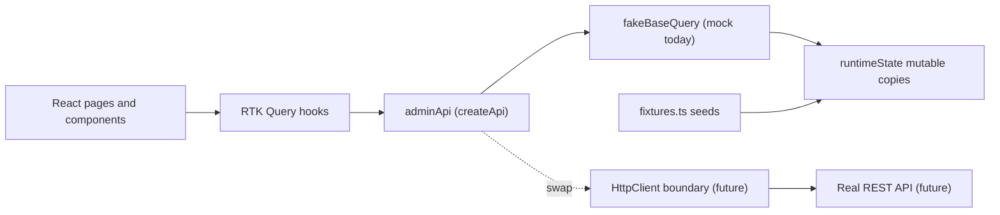

# MyTicket — Admin Dashboard Engineering Reference

> **Scope:** Architecture, schemas, and API surface of the standalone admin dashboard.
> **Companion:** Product flow lives in [`myticket_admin_dashboard_flow.md`](myticket_admin_dashboard_flow.md). Read this file when you need the *what* and *how* (data shapes, endpoints, swap points) instead of the *why*.
> **App location:** [`admin/`](.)
> **Last Updated:** April 30, 2026

---

## 1. Architecture



The admin SPA is fully client-rendered with no server today. Every list, detail, and mutation is wired against an in-memory mutable runtime that is hydrated from immutable fixtures at boot. When the real backend lands, only the `baseQuery` of `adminApi` swaps to `fetchBaseQuery({ baseUrl: import.meta.env.VITE_API_URL })`; the schema layer (Zod) and all hooks stay identical.

### 1.1 Stack

| Concern | Tool | Version |
|---|---|---|
| Build / dev server | Vite | `^8.0.4` (port `5175`) |
| UI runtime | React | `^19.2.4` |
| Language | TypeScript | `~6.0.2` |
| Styling | Tailwind CSS | `^4.2.2` (`@tailwindcss/vite`) + `tw-animate-css` |
| Components | shadcn primitives | `^4.3.0` |
| State + data | Redux Toolkit / RTK Query | `^2.11.2` (today: `fakeBaseQuery`) |
| Validation | Zod | `^3.24.2` |
| Forms | react-hook-form + `@hookform/resolvers/zod` | `^7.71.1` / `^5.2.2` |
| Charts | Recharts | `^3.8.0` |
| Toasts | Sonner | `^2.0.7` |
| Routing | React Router DOM | `^7.14.0` |
| Icons | lucide-react | `^0.562.0` |
| Tests | Vitest + Testing Library | `^4.0.16` / `^16.3.0` |

### 1.2 Future HTTP boundary

[`src/services/httpClient.ts`](src/services/httpClient.ts) declares the `HttpClient` interface (`HttpMethod`, `HttpRequest`, `HttpResponse`) the real backend will satisfy. Today's [`adminApi`](src/services/adminApi.ts) is comment-tagged with the swap line:

```ts
// Swap `baseQuery` to `fetchBaseQuery({ baseUrl: import.meta.env.VITE_API_URL })`
// when the backend is ready.
```

Network latency is simulated through [`src/services/delay.ts`](src/services/delay.ts) (per-endpoint `await delay(ms)` calls) so loading states are realistic in dev.

---

## 2. Routing map

Defined in [`src/App.tsx`](src/App.tsx). Routes nested under `RequireAdmin` + `AdminShell` require an authenticated admin session.

| Path | Page | Access | Dynamic params |
|---|---|---|---|
| `/login` | `LoginPage` | Public | — |
| `/forgot-password` | `ForgotPasswordPage` | Public | — |
| `/reset-password` | `ResetPasswordPage` | Public | — |
| `/access-denied` | `AccessDeniedPage` | Public | — |
| `/` | `DashboardHomePage` | Admin | — |
| `/approvals/roles` | `RoleApplicationsPage` | Admin | — |
| `/approvals/roles/:id` | `RoleApplicationDetailPage` | Admin | `id` (RoleApplication.id) |
| `/approvals/talent` | `TalentApprovalsPage` | Admin | — |
| `/approvals/talent/:id` | `TalentApprovalDetailPage` | Admin | `id` (TalentProfile.id) |
| `/users` | `UsersPage` | Admin | — |
| `/users/:id` | `UserDetailPage` | Admin | `id` (User.id) |
| `/events` | `EventsListPage` | Admin | — |
| `/events/categories` | `EventCategoriesPage` | Admin | — |
| `/events/featured` | `FeaturedEventsPage` | Admin | — |
| `/events/cancellations` | `EventCancellationPage` | Admin | — |
| `/events/:id` | `EventDetailPage` | Admin | `id` (Event.id) |
| `/profile` | `AdminProfilePage` | Admin | — |
| `/settings/fees` | `FeesPage` | Admin | — |
| `/settings/notifications` | `NotificationsPage` | Admin | — |
| `/analytics` | `AnalyticsPage` | Admin | — |
| `/moderation/listings` | `ListingsPage` | Admin | — |
| `/moderation/ratings` | `RatingsPage` | Admin | — |
| `/support` | `SupportInboxPage` | Admin | — |
| `/support/:id` | `SupportThreadPage` | Admin | `id` (SupportThread.id) |
| `*` | redirect → `/` | — | — |

Sidebar groupings live in [`src/config/nav.ts`](src/config/nav.ts): `NAV_OVERVIEW`, `NAV_APPROVALS`, `NAV_OPERATIONS`, `NAV_SETTINGS`, `NAV_INSIGHTS`, `NAV_TRUST`, `NAV_SUPPORT`, composed into `NAV_GROUPS`.

---

## 3. Auth & session

Demo-only authentication, swappable for the real provider.

| Piece | File | Purpose |
|---|---|---|
| Provider | [`src/contexts/AuthContext.tsx`](src/contexts/AuthContext.tsx) | `signIn`, `signOut`, session hydration from `sessionStorage`. |
| Context type | [`src/contexts/adminAuthContext.ts`](src/contexts/adminAuthContext.ts) | `SessionUser`, `AuthContextValue`. |
| Demo credentials | [`src/config/demoAuth.ts`](src/config/demoAuth.ts) | `DEMO_ADMIN_EMAIL = 'admin@myticket.demo'`, `DEMO_ADMIN_PASSWORD = 'password'`. |
| Route guard | [`src/components/auth/RequireAdmin.tsx`](src/components/auth/RequireAdmin.tsx) | Redirects unauthenticated → `/login`, non-admin → `/access-denied`. |
| Hook | [`src/hooks/useAuth.ts`](src/hooks/useAuth.ts) | Convenience accessor. |

**Sign-in rule (demo):** `email === DEMO_ADMIN_EMAIL` *or* email contains `+admin` (case-insensitive); password `length >= 4`. Failures bucket into `'invalid' | 'not_admin'`.

**Session storage:** `sessionStorage` key `myticket_admin_session_v1` (cleared on sign-out, automatically dropped on tab close).

**`SessionUser`:**

| Field | Type | Notes |
|---|---|---|
| `email` | `string` | Trimmed, lowercased input is what authenticates. |
| `name` | `string` | Currently derived as the email's local part. |
| `role` | `'admin'` (`AdminRole`) | Always `admin` after a successful demo sign-in. |

---

## 4. State

Configured in [`src/app/store.ts`](src/app/store.ts):

```
store
├── analyticsUi      ← createSlice (UI-only)
└── adminApi         ← createApi (RTK Query, fakeBaseQuery)
```

### 4.1 `analyticsUi` slice

[`src/app/analyticsUiSlice.ts`](src/app/analyticsUiSlice.ts) — UI-only filter for the analytics page.

| Field | Type | Default | Action |
|---|---|---|---|
| `revenueChartRange` | `RevenueChartRange` (`'7d' | '30d' | '90d'`) | `'7d'` | `setRevenueChartRange(payload)` |

### 4.2 `adminApi` cache

Tag types declared in [`src/services/adminApi.ts`](src/services/adminApi.ts):

```
'Dashboard' | 'RoleApplications' | 'TalentProfiles' | 'Users'
'Events'    | 'Categories'       | 'Featured'        | 'Fees'
'Notifications' | 'Analytics' | 'Moderation' | 'Ratings' | 'Support'
```

Mutations invalidate one or more of these tags so dependent queries refetch automatically. List endpoints additionally `provide` per-id tags (e.g. `{ type: 'Events', id: '...' }`) so detail screens stay in sync after item-level mutations.

---

## 5. Mock data layer

This is what the **real database will own**. Today it is split into two cooperating files.

### 5.1 Immutable seeds — `src/mock/fixtures.ts`

Each named export is parsed through its Zod schema at module load (so any drift between fixture and schema crashes fast):

| Fixture | Schema |
|---|---|
| `MOCK_DASHBOARD_SUMMARY` | `dashboardSummarySchema` |
| `MOCK_PENDING_ACTIONS` | `pendingActionsResponseSchema` |
| `MOCK_ROLE_APPLICATIONS` | `roleApplicationsListSchema` |
| `MOCK_TALENT_PROFILES` | `talentProfilesListSchema` |
| `MOCK_USERS` / `MOCK_USER_DETAILS` | `adminUserListSchema` / `adminUserDetailSchema` |
| `MOCK_EVENTS` | `adminEventListSchema` |
| `MOCK_CATEGORIES` | `eventCategoryListSchema` |
| `MOCK_FEATURED_CONFIG` | `featuredEventsConfigSchema` |
| `MOCK_FEE_CONFIG` | `feeConfigurationSchema` |
| `MOCK_NOTIFICATION_SETTINGS` | `notificationSettingsSchema` |
| `MOCK_LISTING_MODERATION` | `listingModerationListSchema` |
| `MOCK_RATINGS` | `ratingListSchema` |
| `MOCK_SUPPORT_THREADS` / `MOCK_SUPPORT_DETAILS` | `supportThreadListSchema` / `supportThreadDetailSchema` |
| `MOCK_FINANCIAL_ANALYTICS` | `financialAnalyticsSchema` |
| `MOCK_PLATFORM_COUNTERS` | `platformCountersSchema` |
| `MOCK_LEADERBOARDS` | `leaderboardsSchema` |

### 5.2 Mutable runtime — `src/mock/runtimeState.ts`

`structuredClone(...)` of every fixture used by mutations. `adminApi` mutations reach into these arrays/maps to update items (status flips, replies appended, categories upserted, etc.). Reloading the page re-clones the seeds, which mimics a "fresh database" reset.

| Runtime store | Cloned from |
|---|---|
| `roleApplicationsState` | `MOCK_ROLE_APPLICATIONS` |
| `talentProfilesState` | `MOCK_TALENT_PROFILES` |
| `usersState` / `userDetailsState` | `MOCK_USERS` / `MOCK_USER_DETAILS` |
| `eventsState` | `MOCK_EVENTS` |
| `categoriesState` | `MOCK_CATEGORIES` |
| `featuredConfigState` | `MOCK_FEATURED_CONFIG` |
| `feeConfigState` | `MOCK_FEE_CONFIG` |
| `notificationSettingsState` | `MOCK_NOTIFICATION_SETTINGS` |
| `supportThreadsState` / `supportDetailsState` | `MOCK_SUPPORT_THREADS` / `MOCK_SUPPORT_DETAILS` |
| `listingModerationState` | `MOCK_LISTING_MODERATION` |

> Aggregates (`MOCK_DASHBOARD_SUMMARY`, `MOCK_FINANCIAL_ANALYTICS`, `MOCK_PLATFORM_COUNTERS`, `MOCK_LEADERBOARDS`, `MOCK_RATINGS`, `MOCK_PENDING_ACTIONS`) are read directly from the immutable fixture — they stand in for materialized views / read-only projections that the real backend will compute.

---

## 6. Domain enumerations

Single source of truth for every closed set in the system. Schemas in [`src/schemas/shared.ts`](src/schemas/shared.ts) re-export the canonical TS unions in [`src/types/domain.ts`](src/types/domain.ts).

| Enum | Values | Source | Used by |
|---|---|---|---|
| `AdminRole` | `'admin'` | [`src/types/domain.ts`](src/types/domain.ts) | `SessionUser.role` |
| `PlatformUserRole` | `'guest' | 'talent' | 'vendor' | 'organizer'` | `platformUserRoleSchema` ([`shared.ts`](src/schemas/shared.ts)) | `AdminUserRow.role`, sidebars |
| `RoleApplicationType` | `'talent' | 'vendor' | 'organizer'` | `roleApplicationTypeSchema` ([`shared.ts`](src/schemas/shared.ts)) | `RoleApplication.type` |
| `ReviewStatus` | `'pending' | 'approved' | 'rejected'` | `reviewStatusSchema` ([`shared.ts`](src/schemas/shared.ts)) | `RoleApplication.status`, `TalentProfile.status` |
| `SupportStatus` | `'open' | 'in_progress' | 'resolved'` | `supportStatusSchema` ([`shared.ts`](src/schemas/shared.ts)) | `SupportThread.status` |
| `EventLifecycleStatus` | `'active' | 'ended' | 'cancelled' | 'archived'` | `eventLifecycleSchema` ([`event.schema.ts`](src/schemas/event.schema.ts)) | `AdminEventRow.status` |
| `GovernmentIdStatus` | `'pending' | 'verified' | 'rejected'` | `governmentIdStatusSchema` ([`talentApproval.schema.ts`](src/schemas/talentApproval.schema.ts)) | `TalentProfile.governmentIdStatus` |
| `ListingKind` | `'talent' | 'vendor'` | inline in [`moderation.schema.ts`](src/schemas/moderation.schema.ts) | `ListingModerationRow.kind` |
| `ListingModerationStatus` | `'queued' | 'actioned'` | inline in [`moderation.schema.ts`](src/schemas/moderation.schema.ts) | `ListingModerationRow.status` |
| `FeaturedMode` | `'algorithm' | 'manual_override'` | inline in [`event.schema.ts`](src/schemas/event.schema.ts) | `FeaturedEventsConfig.mode` |
| `FeeType` | `'percent' | 'flat' | 'combined'` | `feeTypeSchema` ([`settings.schema.ts`](src/schemas/settings.schema.ts)) | `FeeConfiguration.feeType` |
| `FeePayer` | `'buyer' | 'organizer'` | `feePayerSchema` ([`settings.schema.ts`](src/schemas/settings.schema.ts)) | `FeeConfiguration.payer` |
| `SupportMessageAuthor` | `'user' | 'admin'` | inline in [`support.schema.ts`](src/schemas/support.schema.ts) | `SupportMessage.author` |
| `PendingActionKind` | `'role_application' | 'talent_profile' | 'support'` | inline in [`dashboard.schema.ts`](src/schemas/dashboard.schema.ts) | `PendingAction.kind` |
| `PendingActionPriority` | `'high' | 'normal'` | inline in [`dashboard.schema.ts`](src/schemas/dashboard.schema.ts) | `PendingAction.priority` |
| `RevenueChartRange` | `'7d' | '30d' | '90d'` | [`src/types/analytics.ts`](src/types/analytics.ts) | `analyticsUi.revenueChartRange`, `getFinancialAnalytics` arg |

---

## 7. Data model — entity-by-entity field listings

Field-level breakdown of every Zod entity in the app. Use this as the basis for the real database design. **Required** unless marked `optional`. Field types are TypeScript-flavored; ISO date strings are stored as `string` today and should map to a real `timestamp`/`datetime` type at the backend. URL fields are runtime-validated via `z.string().url()`.

> Legend
> - **Type** — TypeScript shape after `z.infer<...>` (read-only contract; backend should match).
> - **Notes** — enum values, ranges, validation rules, suggested DB hints.

### 7.1 User — [`src/schemas/user.schema.ts`](src/schemas/user.schema.ts)

#### `AdminUserRow` (`adminUserRowSchema`) — list row, candidate primary entity

| Field | Type | Required | Notes |
|---|---|---|---|
| `id` | `string` | Required | Candidate primary key. |
| `displayName` | `string` | Required | Free text. |
| `email` | `string` | Required | `z.string().email()`; should be **unique**. |
| `role` | `PlatformUserRole` | Required | Enum: `guest | talent | vendor | organizer`. Admins are not represented here. |
| `suspended` | `boolean` | Required | Soft-delete-style flag. |
| `joinedAt` | `string` | Required | ISO date string. |

#### `AdminUserDetail` (`adminUserDetailSchema`) — `extends AdminUserRow`

Adds aggregate counters that should be computed views in production:

| Field | Type | Required | Notes |
|---|---|---|---|
| `ticketsPurchased` | `number` (int ≥ 0) | Required | Derived. |
| `bookingsCount` | `number` (int ≥ 0) | Required | Derived. |
| `ratingGivenCount` | `number` (int ≥ 0) | Required | Derived. |

#### `SuspendUserInput` (`suspendUserSchema`) — mutation input

| Field | Type | Required | Notes |
|---|---|---|---|
| `reason` | `string` (≥ 3 chars after trim) | Required | Audit log. |
| `permanent` | `boolean` | Required | If `false`, expected to be a temporary suspension. |

---

### 7.2 RoleApplication — [`src/schemas/roleApplication.schema.ts`](src/schemas/roleApplication.schema.ts)

#### `RoleApplication` (`roleApplicationSchema`)

| Field | Type | Required | Notes |
|---|---|---|---|
| `id` | `string` | Required | Candidate primary key. |
| `applicantName` | `string` | Required | Display only. |
| `email` | `string` | Required | Email; resolves to a future `User`. |
| `type` | `RoleApplicationType` | Required | Enum: `talent | vendor | organizer`. |
| `status` | `ReviewStatus` | Required | Enum: `pending | approved | rejected`. |
| `submittedAt` | `string` | Required | ISO date string. |
| `documentsSummary` | `string` | Required | Short text describing attached documents. |
| `rejectReason` | `string` | Optional | Set when `status === 'rejected'`. |

#### `RejectRoleApplicationInput` (`rejectRoleApplicationSchema`)

| Field | Type | Required | Notes |
|---|---|---|---|
| `reason` | `string` (≥ 3 chars trimmed) | Required | Sent to applicant. |
| `internalNote` | `string` | Optional | Audit-only, not exposed to the applicant. |

---

### 7.3 TalentProfile — [`src/schemas/talentApproval.schema.ts`](src/schemas/talentApproval.schema.ts)

#### `TalentProfile` (`talentProfileSchema`)

| Field | Type | Required | Notes |
|---|---|---|---|
| `id` | `string` | Required | Candidate primary key. |
| `stageName` | `string` | Required | |
| `legalName` | `string` | Required | |
| `email` | `string` | Required | `z.string().email()`. Should resolve to the same `User` as the talent's `RoleApplication.email`. |
| `phone` | `string` | Required | E.164 not enforced today. |
| `country` | `string` | Required | |
| `city` | `string` | Required | |
| `genres` | `string[]` | Required | Many-to-many candidate; promote to a `Genre` table at DB time. |
| `yearsExperience` | `number` (int ≥ 0) | Required | |
| `bio` | `string` | Required | Long form. |
| `websiteUrl` | `string` | Required | Free string today (not URL-validated). |
| `instagramHandle` | `string` | Required | Without `@`. |
| `status` | `ReviewStatus` | Required | `pending | approved | rejected`. |
| `mediaQualityNote` | `string` | Required | Reviewer guidance. |
| `certificatesSummary` | `string` | Required | Free text summary. |
| `submittedAt` | `string` | Required | ISO date. |
| `introVideoUrl` | `string` (URL) | Required | `z.string().url()`. |
| `headshotUrl` | `string` (URL) | Required | `z.string().url()`. |
| `portfolioPdfUrl` | `string` (URL) | Required | `z.string().url()`. |
| `governmentIdStatus` | `GovernmentIdStatus` | Required | Enum: `pending | verified | rejected`. |
| `bankVerified` | `boolean` | Required | Compliance flag. |
| `completedBookings` | `number` (int ≥ 0) | Required | **Derived** — backend should compute. |
| `averageRating` | `number` (0–5) | Required | **Derived** — backend should compute. |
| `rejectReason` | `string` | Optional | Set when `status === 'rejected'`. |

#### `RejectTalentProfileInput` (`rejectTalentProfileSchema`)

| Field | Type | Required | Notes |
|---|---|---|---|
| `reason` | `string` (≥ 3 chars trimmed) | Required | |

---

### 7.4 Event & related — [`src/schemas/event.schema.ts`](src/schemas/event.schema.ts)

#### `AdminEventRow` (`adminEventRowSchema`)

| Field | Type | Required | Notes |
|---|---|---|---|
| `id` | `string` | Required | Candidate primary key. |
| `title` | `string` | Required | |
| `organizerName` | `string` | Required | Display today; should be FK → `User` (organizer) at DB time. |
| `status` | `EventLifecycleStatus` | Required | Enum: `active | ended | cancelled | archived`. |
| `startsAt` | `string` | Required | ISO date. |
| `endsAt` | `string` | Required | ISO date. |
| `ticketsSold` | `number` (int ≥ 0) | Required | **Derived**. |
| `capacity` | `number` (int > 0) | Required | |
| `revenueSar` | `number` (≥ 0) | Required | **Derived**, gross revenue in SAR. |
| `avgRating` | `number` (0–5) | Required | **Derived**. |
| `successRatePercent` | `number` (0–100) | Required | **Derived** check-in / fulfillment proxy. |
| `category` | `string` | Required | Should FK → `EventCategory.id` (or `name`) at DB time. |
| `venueName` | `string` | Required | |
| `city` | `string` | Required | |
| `coverImageUrl` | `string` (URL) | Required | `z.string().url()`. |

#### `EventCategory` (`eventCategorySchema`)

| Field | Type | Required | Notes |
|---|---|---|---|
| `id` | `string` | Required | Candidate primary key. |
| `name` | `string` | Required | Should be **unique**. |
| `iconKey` | `string` | Required | Maps to a UI icon registry. |
| `colorToken` | `string` | Required | Tailwind/theme token name. |
| `active` | `boolean` | Required | Soft toggle without delete. |

#### `UpsertCategoryInput` (`upsertCategorySchema`)

| Field | Type | Required | Notes |
|---|---|---|---|
| `name` | `string` (≥ 2 chars trimmed) | Required | |
| `iconKey` | `string` (≥ 1 char trimmed) | Required | |
| `colorToken` | `string` (≥ 1 char trimmed) | Required | |

> The `active` flag is **not** part of `UpsertCategoryInput`. Toggling is done via the dedicated `toggleCategoryActive` mutation.

#### `FeaturedEventsConfig` (`featuredEventsConfigSchema`) — singleton row

| Field | Type | Required | Notes |
|---|---|---|---|
| `mode` | `'algorithm' | 'manual_override'` | Required | |
| `manualEventIds` | `string[]` | Required | Empty when `mode === 'algorithm'`. Each id should FK → `Event`. |

#### `CancelEventInput` (`cancelEventSchema`) — mutation input

| Field | Type | Required | Notes |
|---|---|---|---|
| `eventId` | `string` | Required | FK → `Event`. |
| `confirmTitle` | `string` (≥ 1 char) | Required | UI requires exact match against `Event.title`. |
| `acknowledgement` | `boolean` | Required | Must be `true` to pass validation. |

---

### 7.5 Settings — [`src/schemas/settings.schema.ts`](src/schemas/settings.schema.ts)

Both shapes are **singleton rows** (one per platform).

#### `FeeConfiguration` (`feeConfigurationSchema`)

| Field | Type | Required | Notes |
|---|---|---|---|
| `feeType` | `FeeType` | Required | Enum: `percent | flat | combined`. |
| `percent` | `number` (0–100) | Required | Used when `feeType` includes `percent`/`combined`. |
| `flatSar` | `number` (≥ 0) | Required | Used when `feeType` includes `flat`/`combined`. |
| `payer` | `FeePayer` | Required | Enum: `buyer | organizer`. |
| `auctionCommissionPercent` | `number` (0–100) | Required | |
| `thirdPartySharePercent` | `number` (0–100) | Required | |

#### `NotificationSettings` (`notificationSettingsSchema`)

| Field | Type | Required | Notes |
|---|---|---|---|
| `channels.email` | `boolean` | Required | |
| `channels.inApp` | `boolean` | Required | |
| `channels.push` | `boolean` | Required | |
| `reminderOffsetsHours` | `number[]` (positive) | Required | Hours before event start (e.g. `[24, 1]`). |

---

### 7.6 Support — [`src/schemas/support.schema.ts`](src/schemas/support.schema.ts)

#### `SupportThread` (`supportThreadSchema`)

| Field | Type | Required | Notes |
|---|---|---|---|
| `id` | `string` | Required | Candidate primary key. |
| `userEmail` | `string` | Required | `z.string().email()`. Should FK → `User`. |
| `subject` | `string` | Required | |
| `status` | `SupportStatus` | Required | Enum: `open | in_progress | resolved`. |
| `updatedAt` | `string` | Required | ISO date — bumped on reply / status change. |
| `preview` | `string` | Required | Last-message preview, used in inbox list. |

#### `SupportMessage` (`supportMessageSchema`)

| Field | Type | Required | Notes |
|---|---|---|---|
| `id` | `string` | Required | |
| `author` | `'user' | 'admin'` | Required | Enum. |
| `body` | `string` | Required | |
| `sentAt` | `string` | Required | ISO date. |

#### `SupportThreadDetail` (`supportThreadDetailSchema`) — `extends SupportThread`

| Field | Type | Required | Notes |
|---|---|---|---|
| `messages` | `SupportMessage[]` | Required | Full conversation history. |

#### `UpdateSupportStatusInput` (`updateSupportStatusSchema`)

| Field | Type | Required | Notes |
|---|---|---|---|
| `status` | `SupportStatus` | Required | New status. |
| `resolutionNote` | `string` | Optional | Audit-only. |

#### `SupportReplyInput` (`supportReplySchema`)

| Field | Type | Required | Notes |
|---|---|---|---|
| `body` | `string` (≥ 1 char trimmed) | Required | |

---

### 7.7 Moderation — [`src/schemas/moderation.schema.ts`](src/schemas/moderation.schema.ts)

#### `ListingModerationRow` (`listingModerationRowSchema`)

| Field | Type | Required | Notes |
|---|---|---|---|
| `id` | `string` | Required | Candidate primary key. |
| `kind` | `'talent' | 'vendor'` | Required | Enum. |
| `title` | `string` | Required | |
| `ownerEmail` | `string` | Required | `z.string().email()`. Should FK → `User`. |
| `flagReason` | `string` | Required | |
| `status` | `'queued' | 'actioned'` | Required | Enum. |

#### `RatingRow` (`ratingRowSchema`)

| Field | Type | Required | Notes |
|---|---|---|---|
| `id` | `string` | Required | Candidate primary key. |
| `targetLabel` | `string` | Required | Polymorphic label — resolves to either an `Event` or a `TalentProfile` in the real model. |
| `authorEmail` | `string` | Required | `z.string().email()`. Should FK → `User`. |
| `stars` | `number` (1–5) | Required | |
| `comment` | `string` | Required | |
| `submittedAt` | `string` | Required | ISO date. |

---

### 7.8 Analytics aggregates — derived / read-only views

These shapes power the dashboard and analytics screens. They are **not** source-of-truth tables; they are projections the real backend will compute on demand. Listed here so the DB design knows which fields the UI expects to consume.

#### `DashboardSummary` — [`src/schemas/dashboard.schema.ts`](src/schemas/dashboard.schema.ts)

| Field | Type | Notes |
|---|---|---|
| `totalUsers` | `number` (int ≥ 0) | All registered users. |
| `totalEvents` | `number` (int ≥ 0) | All events ever created. |
| `totalTicketsSold` | `number` (int ≥ 0) | Lifetime ticket count. |
| `totalRevenueSar` | `number` (≥ 0) | Lifetime gross revenue in SAR. |

#### `PendingAction` (`pendingActionSchema`)

| Field | Type | Notes |
|---|---|---|
| `id` | `string` | Stable id within the snapshot. |
| `kind` | `'role_application' | 'talent_profile' | 'support'` | Drives the icon + deep-link. |
| `title` | `string` | "12 role applications". |
| `subtitle` | `string` | One-liner context. |
| `href` | `string` | Internal route like `/approvals/roles`. |
| `priority` | `'high' | 'normal'` | Drives accent colour. |
| `imageUrl` | `string` (URL) | Card cover. |
| `dueLabel` | `string` | Free-form SLA hint. |

#### `FinancialAnalytics` — [`src/schemas/analytics.schema.ts`](src/schemas/analytics.schema.ts)

| Field | Type | Notes |
|---|---|---|
| `totalRevenueSar` | `number` (≥ 0) | Range-windowed by `RevenueChartRange`. |
| `platformFeesSar` | `number` (≥ 0) | |
| `refundsSar` | `number` (≥ 0) | |
| `payoutsPendingSar` | `number` (≥ 0) | |
| `revenueByDay` | `RevenuePoint[]` | Trend series. |
| `revenueBreakdownByCategory` | `RevenueBreakdownRow[]` | |

##### `RevenuePoint` (`revenuePointSchema`)

| Field | Type | Notes |
|---|---|---|
| `date` | `string` | ISO date (day granularity). |
| `revenueSar` | `number` (≥ 0) | |

##### `RevenueBreakdownRow` (`revenueBreakdownRowSchema`)

| Field | Type | Notes |
|---|---|---|
| `categoryKey` | `string` | Stable key. |
| `label` | `string` | Display text. |
| `revenueSar` | `number` (≥ 0) | |

#### `PlatformCounters` (`platformCountersSchema`)

| Field | Type | Notes |
|---|---|---|
| `usersByRole.guest` | `number` (int ≥ 0) | |
| `usersByRole.talent` | `number` (int ≥ 0) | |
| `usersByRole.vendor` | `number` (int ≥ 0) | |
| `usersByRole.organizer` | `number` (int ≥ 0) | |
| `eventsByStatus.active` | `number` (int ≥ 0) | |
| `eventsByStatus.ended` | `number` (int ≥ 0) | |
| `eventsByStatus.cancelled` | `number` (int ≥ 0) | |
| `eventsByStatus.archived` | `number` (int ≥ 0) | |
| `ticketsSold` | `number` (int ≥ 0) | |
| `bookings` | `number` (int ≥ 0) | |
| `ratings` | `number` (int ≥ 0) | |

#### `Leaderboards` (`leaderboardsSchema`)

| Field | Type | Notes |
|---|---|---|
| `topEvents` | `LeaderboardRow[]` | |
| `topOrganizers` | `LeaderboardRow[]` | |
| `topCategories` | `LeaderboardRow[]` | |

##### `LeaderboardRow` (`leaderboardRowSchema`)

| Field | Type | Notes |
|---|---|---|
| `id` | `string` | |
| `label` | `string` | |
| `metric` | `string` | **TBD** — currently free text; should become an enum during DB design (e.g. `tickets_sold | revenue_sar | rating | bookings`). |
| `value` | `number` | |

---

### 7.9 Non-DB / UI-only types

These are validated locally in forms or stored in `sessionStorage`; they are not persisted as their own entities.

| Type | Source | Where used |
|---|---|---|
| `LoginFormValues` | `loginFormSchema` ([`auth.schema.ts`](src/schemas/auth.schema.ts)) | `LoginPage` form. |
| `ForgotPasswordValues` | `forgotPasswordSchema` ([`auth.schema.ts`](src/schemas/auth.schema.ts)) | `ForgotPasswordPage` form. |
| `ResetPasswordValues` | `resetPasswordSchema` ([`auth.schema.ts`](src/schemas/auth.schema.ts)) | `ResetPasswordPage` form. |
| `SessionUser` | [`adminAuthContext.ts`](src/contexts/adminAuthContext.ts) | `sessionStorage` payload (auth context). |
| `AnalyticsUiState.revenueChartRange` | `analyticsUiSlice` | UI filter only. |

---

## 8. API surface

Every RTK Query endpoint in [`src/services/adminApi.ts`](src/services/adminApi.ts), grouped by resource (== tag type). REST suggestions reflect what the swap to `fetchBaseQuery` should target; mock implementations live behind `fakeBaseQuery`. The `Hook` column lists the auto-generated React hook (`use…Query` / `use…Mutation`).

### 8.1 Dashboard (`Dashboard`)

| Hook | Kind | Input | Output | Suggested REST | Provides | Invalidates |
|---|---|---|---|---|---|---|
| `useGetDashboardSummaryQuery` | Query | — | `DashboardSummary` | `GET /admin/dashboard/summary` | `Dashboard` | — |
| `useGetPendingActionsQuery` | Query | — | `PendingAction[]` | `GET /admin/dashboard/pending-actions` | `Dashboard` | — |

### 8.2 Role Applications (`RoleApplications`)

| Hook | Kind | Input | Output | Suggested REST | Provides | Invalidates |
|---|---|---|---|---|---|---|
| `useGetRoleApplicationsQuery` | Query | — | `RoleApplication[]` | `GET /admin/role-applications` | `RoleApplications` (+ per-id) | — |
| `useGetRoleApplicationQuery` | Query | `string` (id) | `RoleApplication` | `GET /admin/role-applications/:id` | `RoleApplications:id` | — |
| `useApproveRoleApplicationMutation` | Mutation | `string` (id) | `{ ok: true }` | `POST /admin/role-applications/:id/approve` | — | `RoleApplications`, `RoleApplications:id`, `Dashboard` |
| `useRejectRoleApplicationMutation` | Mutation | `{ id: string; body: RejectRoleApplicationInput }` | `{ ok: true }` | `POST /admin/role-applications/:id/reject` | — | `RoleApplications`, `RoleApplications:id`, `Dashboard` |

### 8.3 Talent Profiles (`TalentProfiles`)

| Hook | Kind | Input | Output | Suggested REST | Provides | Invalidates |
|---|---|---|---|---|---|---|
| `useGetTalentProfilesQuery` | Query | — | `TalentProfile[]` | `GET /admin/talent-profiles` | `TalentProfiles` (+ per-id) | — |
| `useGetTalentProfileQuery` | Query | `string` (id) | `TalentProfile` | `GET /admin/talent-profiles/:id` | `TalentProfiles:id` | — |
| `useApproveTalentProfileMutation` | Mutation | `string` (id) | `{ ok: true }` | `POST /admin/talent-profiles/:id/approve` | — | `TalentProfiles`, `TalentProfiles:id`, `Dashboard` |
| `useRejectTalentProfileMutation` | Mutation | `{ id: string; body: RejectTalentProfileInput }` | `{ ok: true }` | `POST /admin/talent-profiles/:id/reject` | — | `TalentProfiles`, `TalentProfiles:id`, `Dashboard` |

### 8.4 Users (`Users`)

| Hook | Kind | Input | Output | Suggested REST | Provides | Invalidates |
|---|---|---|---|---|---|---|
| `useGetUsersQuery` | Query | — | `AdminUserRow[]` | `GET /admin/users` | `Users` (+ per-id) | — |
| `useGetUserQuery` | Query | `string` (id) | `AdminUserDetail` | `GET /admin/users/:id` | `Users:id` | — |
| `useSuspendUserMutation` | Mutation | `{ id: string; body: SuspendUserInput }` | `{ ok: true }` | `POST /admin/users/:id/suspend` | — | `Users`, `Users:id` |

### 8.5 Events (`Events`)

| Hook | Kind | Input | Output | Suggested REST | Provides | Invalidates |
|---|---|---|---|---|---|---|
| `useGetEventsQuery` | Query | — | `AdminEventRow[]` | `GET /admin/events` | `Events` (+ per-id) | — |
| `useGetEventQuery` | Query | `string` (id) | `AdminEventRow` | `GET /admin/events/:id` | `Events:id` | — |
| `useCancelEventMutation` | Mutation | `CancelEventInput` | `{ ok: true }` | `POST /admin/events/:id/cancel` | — | `Events`, `Events:id`, `Dashboard` |

### 8.6 Categories (`Categories`)

| Hook | Kind | Input | Output | Suggested REST | Provides | Invalidates |
|---|---|---|---|---|---|---|
| `useGetCategoriesQuery` | Query | — | `EventCategory[]` | `GET /admin/event-categories` | `Categories` | — |
| `useUpsertCategoryMutation` | Mutation | `{ id?: string; body: UpsertCategoryInput }` | `{ ok: true }` | `POST /admin/event-categories` (no `id`) / `PUT /admin/event-categories/:id` (with `id`) | — | `Categories` |
| `useToggleCategoryActiveMutation` | Mutation | `{ id: string; active: boolean }` | `{ ok: true }` | `PATCH /admin/event-categories/:id/active` | — | `Categories` |

### 8.7 Featured (`Featured`)

| Hook | Kind | Input | Output | Suggested REST | Provides | Invalidates |
|---|---|---|---|---|---|---|
| `useGetFeaturedConfigQuery` | Query | — | `FeaturedEventsConfig` | `GET /admin/events/featured` | `Featured` | — |
| `useSetFeaturedConfigMutation` | Mutation | `FeaturedEventsConfig` | `{ ok: true }` | `PUT /admin/events/featured` | — | `Featured` |

### 8.8 Fees (`Fees`)

| Hook | Kind | Input | Output | Suggested REST | Provides | Invalidates |
|---|---|---|---|---|---|---|
| `useGetFeeConfigurationQuery` | Query | — | `FeeConfiguration` | `GET /admin/settings/fees` | `Fees` | — |
| `useUpdateFeeConfigurationMutation` | Mutation | `FeeConfiguration` | `{ ok: true }` | `PUT /admin/settings/fees` | — | `Fees` |

### 8.9 Notifications (`Notifications`)

| Hook | Kind | Input | Output | Suggested REST | Provides | Invalidates |
|---|---|---|---|---|---|---|
| `useGetNotificationSettingsQuery` | Query | — | `NotificationSettings` | `GET /admin/settings/notifications` | `Notifications` | — |
| `useUpdateNotificationSettingsMutation` | Mutation | `NotificationSettings` | `{ ok: true }` | `PUT /admin/settings/notifications` | — | `Notifications` |

### 8.10 Analytics (`Analytics`)

| Hook | Kind | Input | Output | Suggested REST | Provides | Invalidates |
|---|---|---|---|---|---|---|
| `useGetFinancialAnalyticsQuery` | Query | `RevenueChartRange | void` (default `'7d'`) | `FinancialAnalytics` | `GET /admin/analytics/financial?range=7d|30d|90d` | `Analytics` | — |
| `useGetPlatformCountersQuery` | Query | — | `PlatformCounters` | `GET /admin/analytics/counters` | `Analytics` | — |
| `useGetLeaderboardsQuery` | Query | — | `Leaderboards` | `GET /admin/analytics/leaderboards` | `Analytics` | — |

### 8.11 Moderation (`Moderation`)

| Hook | Kind | Input | Output | Suggested REST | Provides | Invalidates |
|---|---|---|---|---|---|---|
| `useGetListingModerationQuery` | Query | — | `ListingModerationRow[]` | `GET /admin/moderation/listings` | `Moderation` | — |
| `useMarkListingModerationReviewedMutation` | Mutation | `string` (id) | `{ ok: true }` | `POST /admin/moderation/listings/:id/review` | — | `Moderation` |

### 8.12 Ratings (`Ratings`)

| Hook | Kind | Input | Output | Suggested REST | Provides | Invalidates |
|---|---|---|---|---|---|---|
| `useGetRatingsModerationQuery` | Query | — | `RatingRow[]` | `GET /admin/moderation/ratings` | `Ratings` | — |

### 8.13 Support (`Support`)

| Hook | Kind | Input | Output | Suggested REST | Provides | Invalidates |
|---|---|---|---|---|---|---|
| `useGetSupportThreadsQuery` | Query | — | `SupportThread[]` | `GET /admin/support` | `Support` (+ per-id) | — |
| `useGetSupportThreadQuery` | Query | `string` (id) | `SupportThreadDetail` | `GET /admin/support/:id` | `Support:id` | — |
| `useUpdateSupportStatusMutation` | Mutation | `{ id: string; body: UpdateSupportStatusInput }` | `{ ok: true }` | `PATCH /admin/support/:id/status` | — | `Support`, `Support:id` |
| `useAddSupportReplyMutation` | Mutation | `{ threadId: string; body: string }` | `{ ok: true }` | `POST /admin/support/:id/replies` | — | `Support`, `Support:threadId` |

---

## 9. Cross-entity relations

Today's mock layer keeps relations as denormalised text/email fields. The DB design should formalise these as foreign keys.

| Mock field | Lives on | Future relation |
|---|---|---|
| `AdminEventRow.organizerName` | `Event` | FK → `User` (organizer). Should be `organizerId`; display name comes from join. |
| `AdminEventRow.category` | `Event` | FK → `EventCategory.id` (or stable `categoryKey`). |
| `RoleApplication.email` | `RoleApplication` | Resolves to the same future `User` as the applicant; consider a nullable `userId` once the user signs up. |
| `TalentProfile.email` | `TalentProfile` | Same `User` as the talent's `RoleApplication`; one talent profile per `User` of role `talent`. |
| `TalentProfile.genres[]` | `TalentProfile` | Promote to a `Genre` table + `TalentGenre` join. |
| `RatingRow.targetLabel` | `RatingRow` | Polymorphic — should become `targetKind` (`event | talent`) + `targetId` FK. |
| `RatingRow.authorEmail` | `RatingRow` | FK → `User`. |
| `ListingModerationRow.ownerEmail` | `ListingModerationRow` | FK → `User`. |
| `ListingModerationRow.kind` + `id` | `ListingModerationRow` | The listing should also FK to either a `TalentProfile` or `VendorProfile` row. |
| `FeaturedEventsConfig.manualEventIds[]` | singleton `FeaturedEventsConfig` | Many-to-many with `Event` (or a derived `featured_event` join table). |
| `SupportThread.userEmail` | `SupportThread` | FK → `User` (the requester). |
| `SupportMessage.author` | `SupportMessage` | Enum today; in the real model the `admin` author should also FK to the actual admin `User`. |
| `PendingAction.href` | `PendingAction` (read-only view) | Each `kind` resolves to a queue + ids in the source-of-truth tables (`RoleApplication`, `TalentProfile`, `SupportThread`). |
| `PlatformCounters.usersByRole.*` | aggregate | Materialized view over `User.role`. |

---

## 10. Notes & TBDs

- **Cancellation refund agreement** — the platform/organizer refund split and timing are still TBD (matches the open item in [`myticket_admin_dashboard_flow.md`](myticket_admin_dashboard_flow.md) §6 *Event Cancellation*). Persist the agreement once finalised; today only the cancel intent is captured.
- **Vendor profile schema** — there is no first-class `VendorProfile` Zod model yet. Vendors surface only through `RoleApplication.type === 'vendor'` and `ListingModerationRow.kind === 'vendor'`. A dedicated schema will be needed to mirror `TalentProfile`.
- **`LeaderboardRow.metric`** — currently a free `string`; promote to an enum (e.g. `tickets_sold | revenue_sar | rating | bookings`) during DB design so the UI can format values precisely.
- **Admin profile persistence** — `/profile` saves are mock-only; there is no `updateAdminProfile` endpoint or schema yet. Add `AdminProfile` (display name, timezone, daily digest opt-in) and a corresponding mutation when the backend lands.
- **Aggregates** — every shape under §7.8 is **derived**. The real backend should compute these on demand or via materialized views, not store them as primary entities.
- **Email as identity** — several mock schemas (`SupportThread`, `ListingModerationRow`, `RatingRow`, `RoleApplication`, `TalentProfile`) use `email` as the user reference. Migrate these to `userId` FKs as part of the DB cutover; keep `email` as a column on `User` only.
- **`websiteUrl` / `instagramHandle` on `TalentProfile`** — currently free strings (no URL/regex enforcement). Tighten validation when DB constraints are added.
